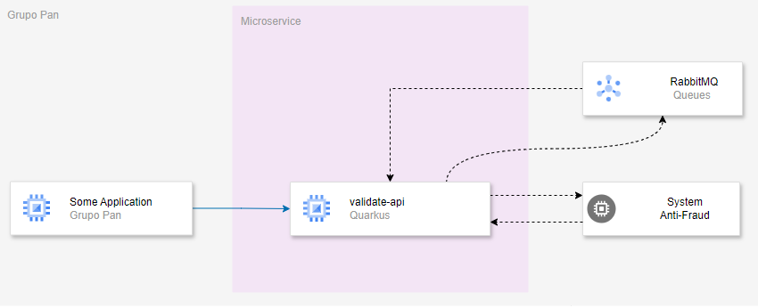

### Introduction

Application for integration with Anti-Fraud system


`validate-api` microservices project.

* Quarkus
* REST API
* RabbitMQ
* Docker


### Developer Environment

 Build docker image RabbitMQ
```
  ../doc/docker_script.sh  -> Script for Docker.
  ../doc/podman_script.sh  -> Script for Podman.
```
Build app Anti-Fraud-Mock
```
  Path:
  ../desafio-pan/antifraud-mock  
  
   Instal lib:
      npm install 
    
   Run app:
      npm run start
```

### System Design 



